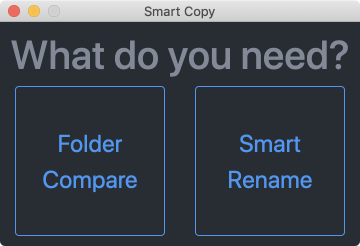
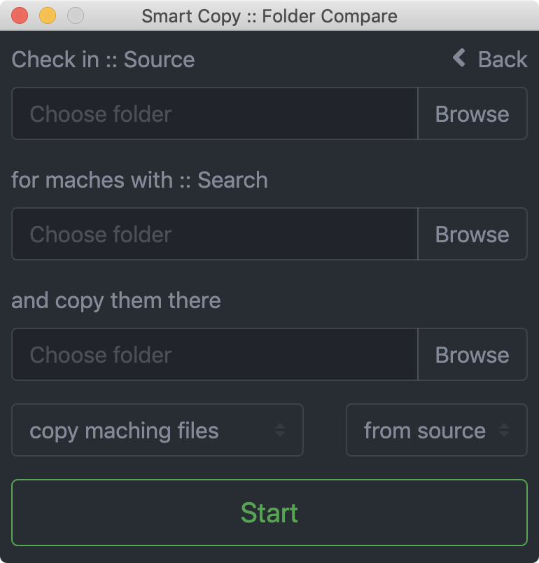
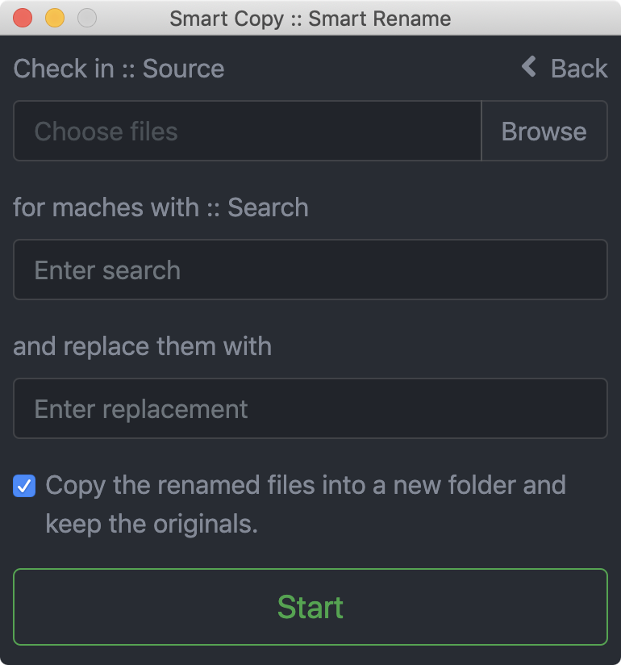

# FolderCompare
Compare two folders and copy the maching or not maching files into a third one.

Available for: MacOS, Linux and Windows.

## Screenshots

### Menu

### Folder Compare

### Smart Rename

